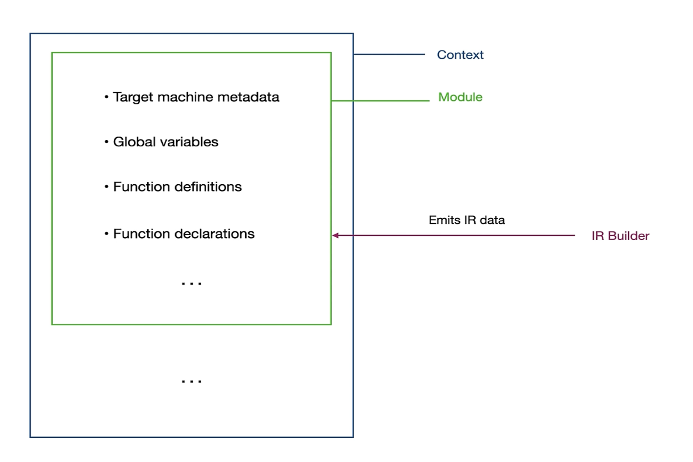

# Compiling tips

Once we have a `.ll` file with llvm intermediate language. We can then target different architectures when compiling it using `llc`

- MIPS: `llc --mtriple=mips-unknown-unknown  playground_output.ll -o playground_output_mips.s`

- wasm32" `llc --mtriple=wasm32-unknown-unknown  playground_output.ll -o playground_output_wasm32.s`

For `bitcode` generation, we can use `llvm-as` to generate a `.bc` file. For example: `llvm-as playground_output.ll`

# LLVM Structure
